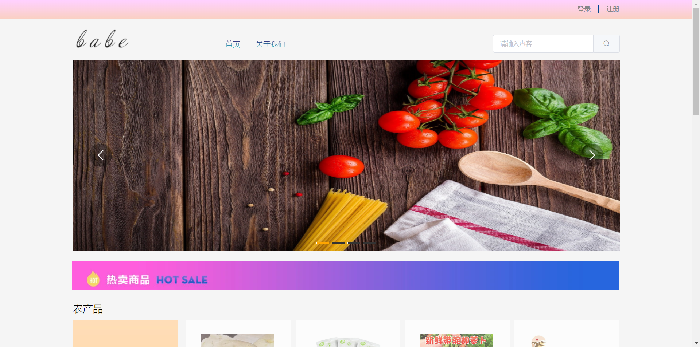

# demo-vue

> A Vue.js project

## Build Setup

``` bash
# install dependencies
npm install

# serve with hot reload at localhost:8080
npm run dev

项目使用的 Vue + Element-ui的语言及框架
下载完本项目，在终端使用vue的命令即可
# install dependencies
npm install

运行项目输入此命令
# serve with hot reload at localhost:8080
npm run dev

以下为项目展示页面


