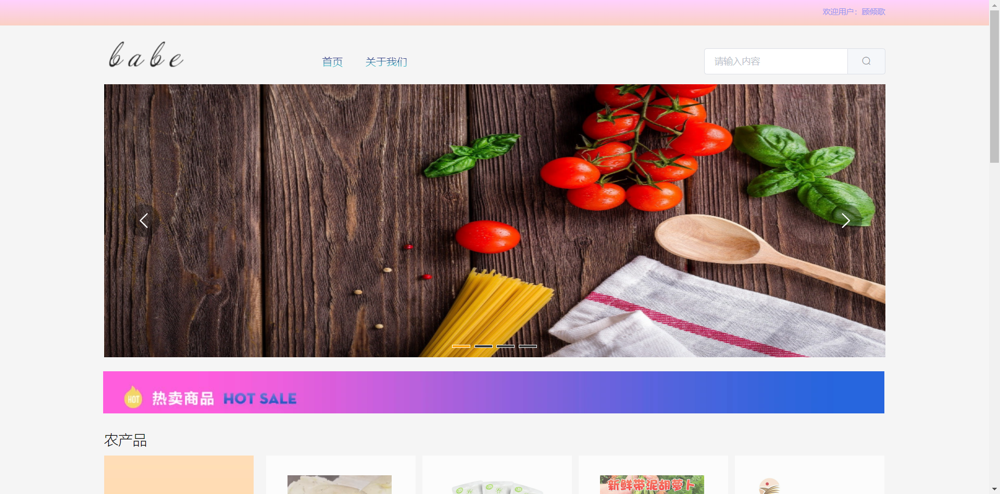
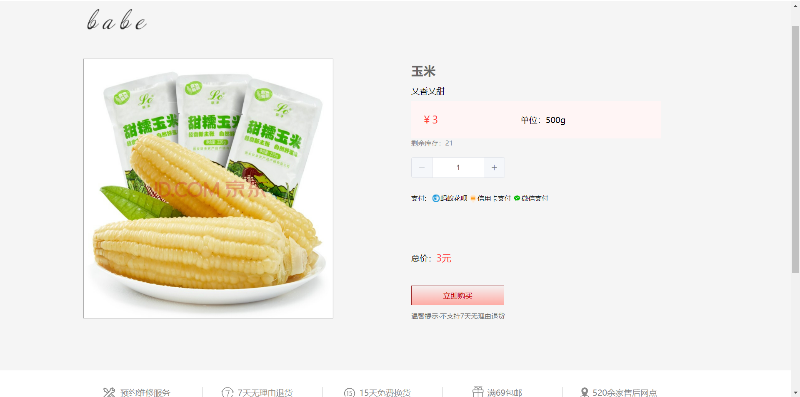
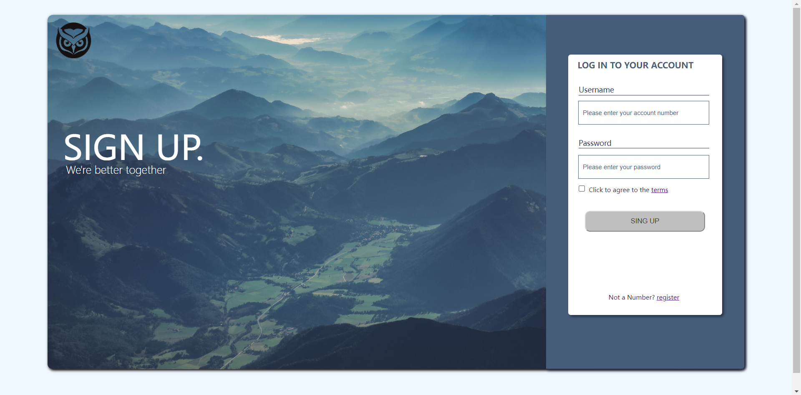
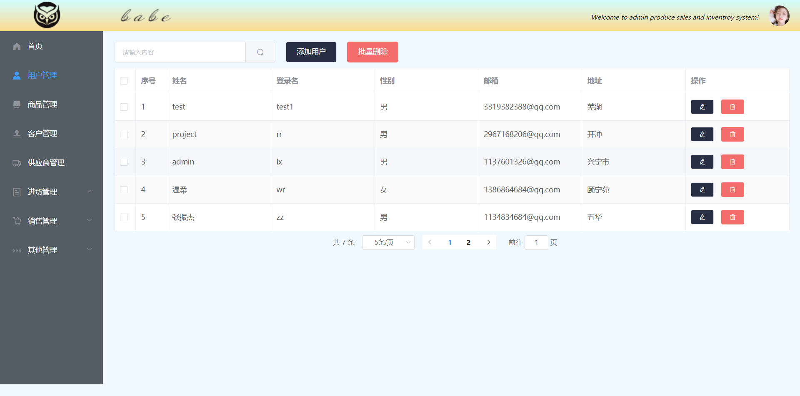
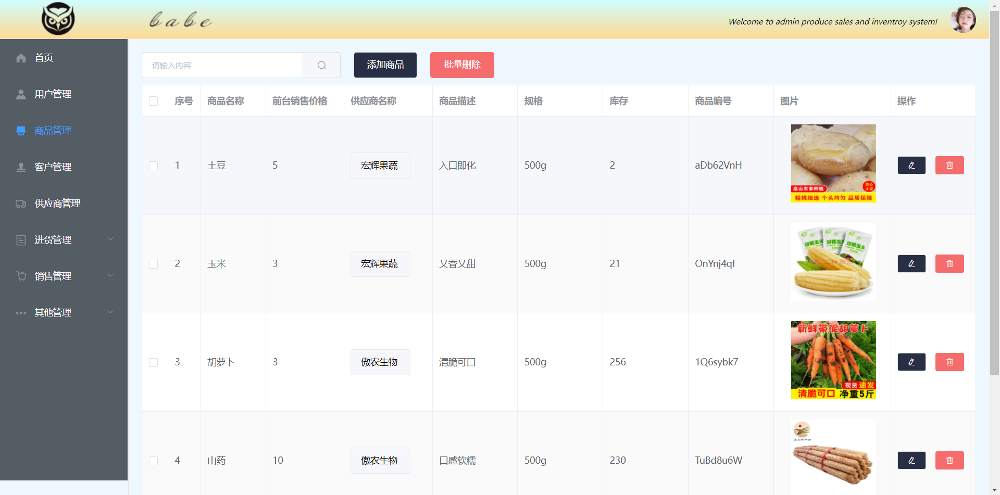
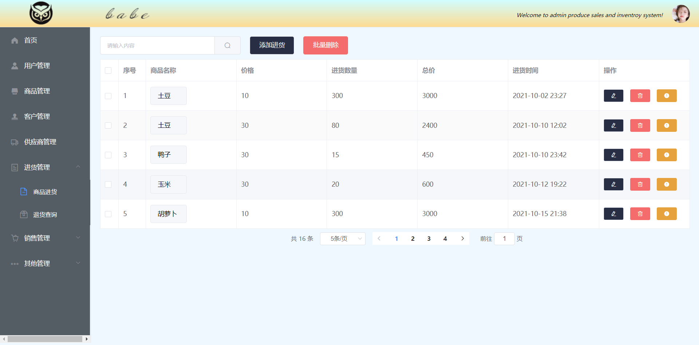
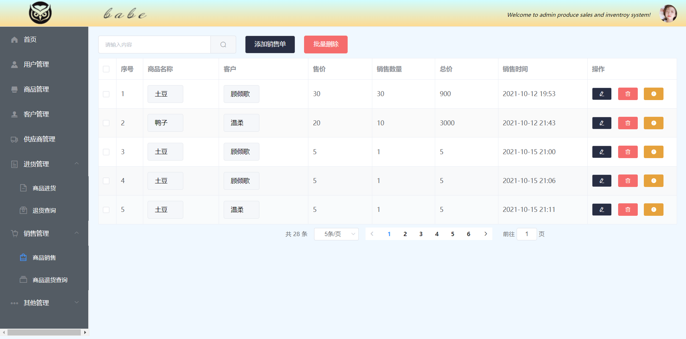
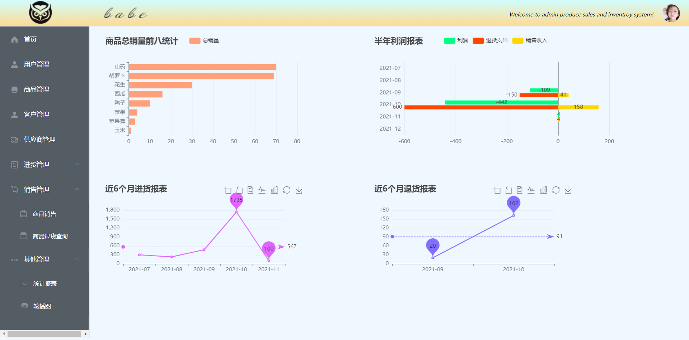

# demo-vue

> A Vue.js project

后端开源地址：https://github.com/LX-GQG/springboot-Backstage-management

## Build Setup

项目使用的 Vue + Element-ui的语言及框架
项目使用的端口号为8080
下载完本项目，在终端使用vue的命令即可
# install dependencies
npm install

运行项目输入此命令
# serve with hot reload at localhost:8080
npm run dev

以下为项目展示
# 前台首页

# 前台搜索页

# 前台详情页

# 后台登录

# 后台首页

# 后台用户管理

# 后台商品管理

# 后台进货界面

# 后台销售

# 后台统计报表

# 后台轮播图管理

